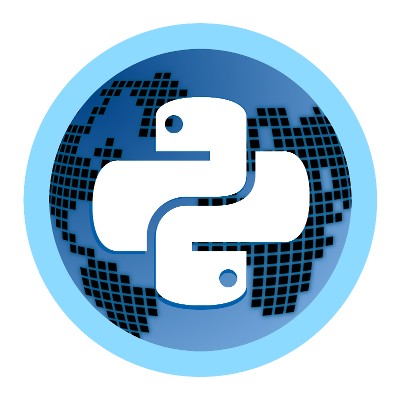

.. PyPlanet documentation master file, created by
   sphinx-quickstart on Thu Mar 16 11:38:18 2017.
   You can adapt this file completely to your liking, but it should at least
   contain the root `toctree` directive.

Welcome to PyPlanet's documentation!
====================================

..  toctree::
    :maxdepth: 2
    :caption: Contents:

    intro/index
    core/index

.. warning::

    The documentation is still not completed.

Indices and tables
==================

* :ref:`genindex`
* :ref:`modindex`
* :ref:`search`
